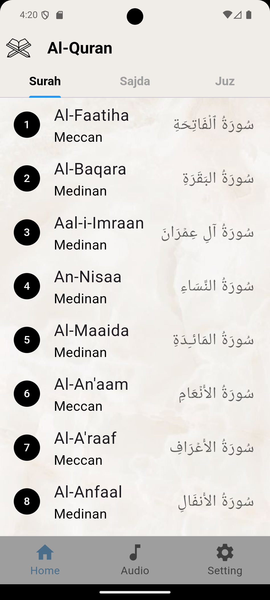
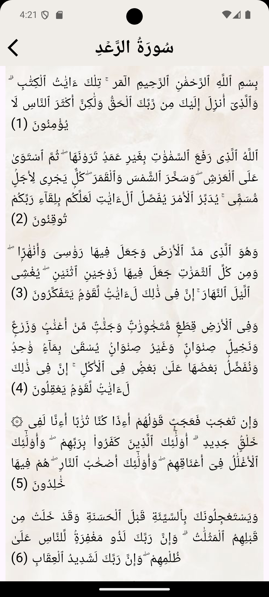
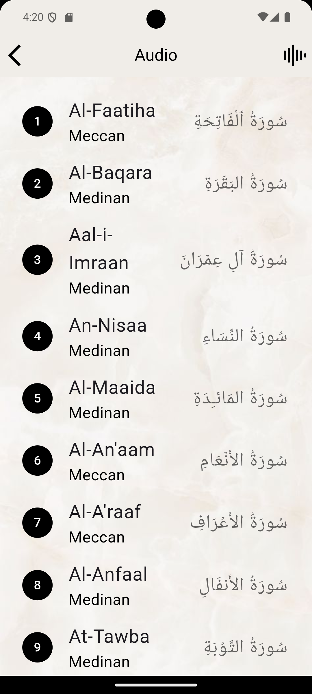
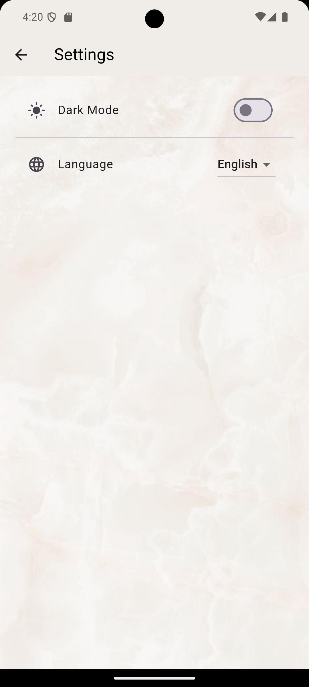
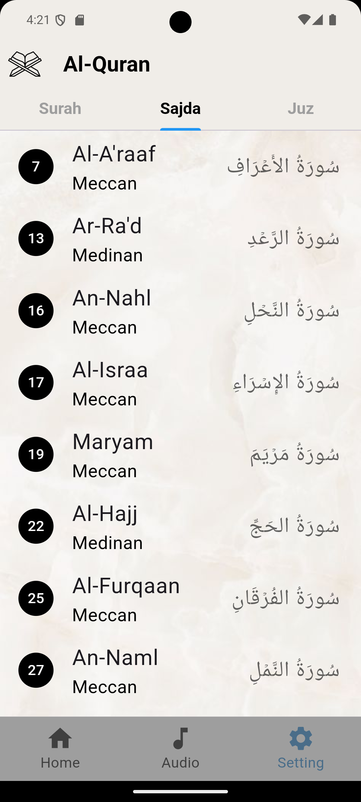
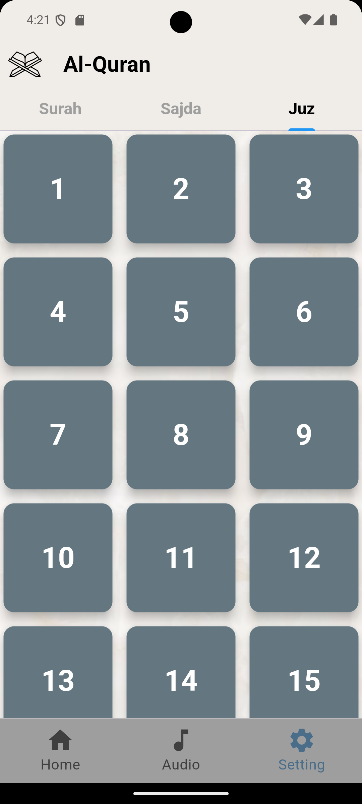
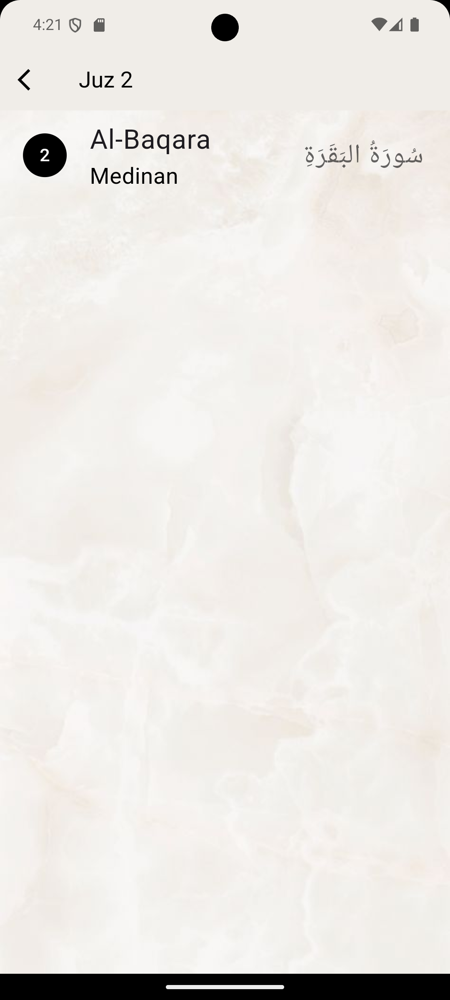
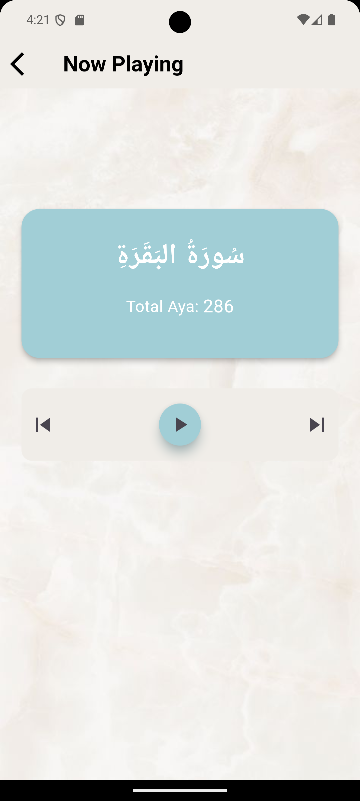
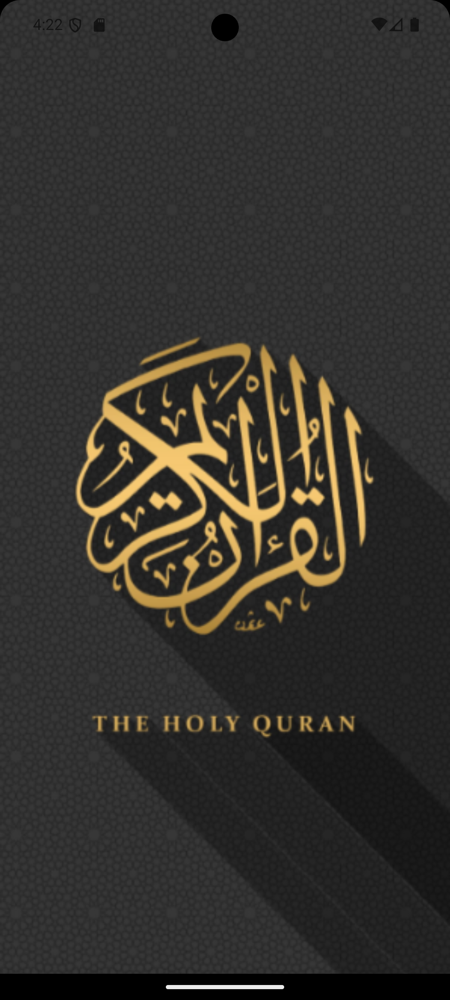

<h1 align="center">📖 Quran App</h1>

<p align="center">
  A beautifully designed and responsive <strong>Quran mobile application</strong> developed using <strong>Flutter</strong>.
  The app allows users to browse Surahs, play audio recitations, and enjoy a smooth, intuitive user experience powered by <strong>RESTful APIs</strong>.
</p>


---

## 🌟 Overview

Quran App is a Flutter-based mobile application that displays the full list of Quranic Surahs fetched from an API, with support for audio playback for each Surah. The app features a clean UI and responsive layout that works seamlessly across different screen sizes.

This project was created as a practical implementation to strengthen my skills in Flutter, API integration, and building real-world Islamic mobile applications.

---

## 🚀 Features

- 📜 **Surah Listing:** Fetch and display all Surahs using a RESTful API.
- 🔊 **Audio Playback:** Stream audio for each Surah.
- 📱 **Responsive UI:** Optimized for both phones and tablets.
- 🌙 **Islamic Design Touch:** Minimal and calm user interface aligned with the purpose of the app.
- ⚡ **Smooth Performance:** Built with best practices to ensure fast loading and responsiveness.

---


📸 Screenshots
<p align="center">
  
  
  
  
  
  
  
  
  
  
</p>


---

## 📂 Folder Structure

```plaintext
lib/
├── core/             # API services and utilities
│   └── api_service.dart
├── models/           # Surah models
│   └── surah_model.dart
├── screens/          # UI screens
│   ├── home_screen.dart
│   ├── surah_detail_screen.dart
│   └── audio_player_screen.dart
├── widgets/          # Reusable UI components
│   └── surah_tile.dart
├── bloc/             # Bloc state management files
│   ├── surah_bloc.dart
│   ├── surah_event.dart
│   └── surah_state.dart
└── main.dart         # App entry point

To run the app locally, follow these steps:
# 1. Make sure Flutter SDK is installed
flutter --version

# 2. Clone the repository
git clone https://github.com/tokaahmed345/Al-Quran-app.git
cd Al-Quran-app

# 3. Install dependencies
flutter pub get

# 4. Run the app
flutter run